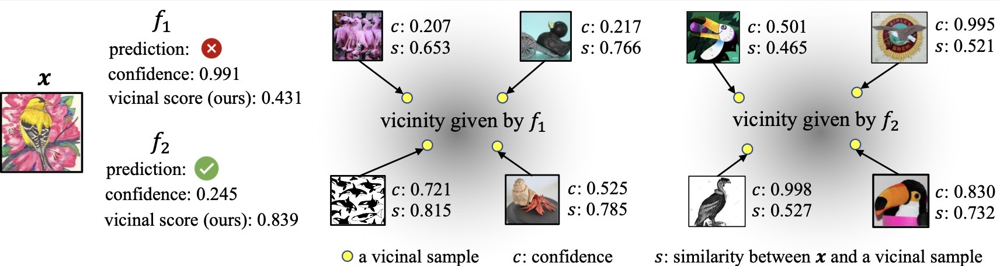

# Assessing Model Generalization in Vicinity

 [Yuchi Liu](https://liuyvchi.github.io/), [Yifan Sun](https://yifansun-reid.github.io/), [Jingdong Wang](https://jingdongwang2017.github.io/), [Liang Zheng](https://zheng-lab.cecs.anu.edu.au)

This repository contains the implementation for the paper "Assessing Model Generalization in Vicinity".




---

## Preparation


#### :wrench: Installation

Before running the scripts, ensure you have Python installed along with the necessary packages. To install the required packages, execute the following command:

```bash
pip install -r requirements.txt
```

#### :wrench:  Downlaod Models

Please check the Experimental Setup section in our paper.

#### :wrench:  Feature extractiion

```bash
bash src/test_getOutput.sh
```

##### Note

You can cahnge the python files in `test_getOutput.sh` to change the datasets"
- `test_savePredictions.py` : for Iamgenet Setup
- `test_savePredictions_cifar.py` : for cifar Setup
- `test_savePredictions_iwilds.py` : for iWilds Setup
  


#### Directory Structure Preparation

To utilize the provided scripts effectively, please organize your data according to the following directory structure:

```
├── data
│   ├── ImageNet-Val
│   ├── ImageNet-A
│   ├── ImageNet-R
│   └── ...
└── modelOutput
    ├── imagenet_a_out_colorjitter
    |   ├── tv_reesnet152.npy
    │   └── ...
    |    
    ├── imagenet_a_out_grey
    ├── imagenet_a_out_colorjitter
    └── ...
|── iwildcam_weights
|── ...
└── src
```


---

## Test

## Compute Model Risks Proxies

To compute model risk estimation under different setups, run the following commands:

- :wrench: ImageNet setup:
```bash
python src/test_mentric.py
```

- Cifar10 setup:
```bash
python src/test_metric_cifar.py
```

- iWildCam setup:
```bash
python src/test_metric_iwilds.py
```

### :wrench: Evaluation

You can compute the correlation between the estimated model risks and their accuracy by running the following command:

```bash
python src/compute_correlation.py
```

---

## Citation

If you find our code helpful, please consider citing our paper:

```bibtex

```

## License

This project is open source and available under the [MIT License](LICENSE.md).

---

Let me know if there's anything else you need!